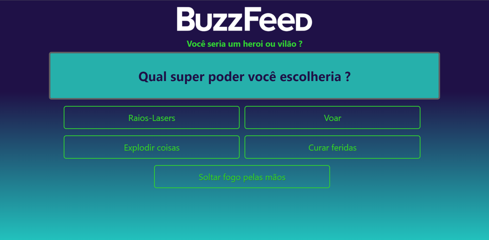
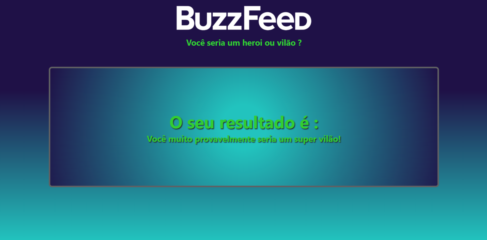

# Desafio-de-projeto-ANGULAR-2-DIO

Academic project for delivery

> Result of the semi-finished project. This project aimed to establish the knowledge acquired in the ANGULAR / TypeScript module:
 

- 
- 
- 
- 

 

 
 

 

#### 🤝 Collaborators

<table>
  <tr>
    <td align="center">
      <a href="https://www.linkedin.com/in/edmar-radanovis-0130b611a/">
         
        
          <b>Edmar Radanovis</b>
        
      </a>
    </td>
    <td align="center">
       <a href="https://www.dio.me/">
         
        
          <b>DIO.me</b>
        
      </a>
  </tr>
</table>
 

 

##### 👍🏆 special thank's to ...

<table>
  <tr>
    <td align="center">
      <a href="https://www.nttdata.com/global/en/">
       
      
        <b>Trusted Global Innovator</b>
      
      </a>
    </td>
  </tr>
</table> 
    
##### ...for sponsoring this awesome bootcamp! 👍🏆
 
 

[⬆ Voltar ao topo](#desafio-de-projeto-angular-2-dio) 
